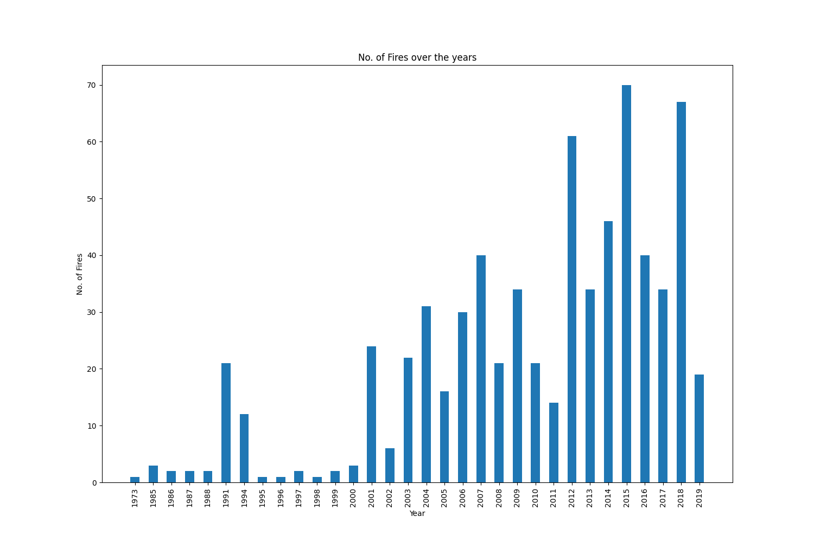

# CMPE255 Project - Wildfire Analysis and Prediction

## Team Members
1. Mohmmadsalman Mal :[salmanmal](https://github.com/salmanmal)
2. Parvathy Kannankumarath Madom Krishnan :[parvathysjsu](https://github.com/parvathysjsu)
3. Sanjana Srinivas :[Sanjana7395](https://github.com/Sanjana7395)
4. Sung-Yin Yang :[SungYinYang](https://github.com/SungYinYang)

## Dataset and Source
1. Dataset from Washington Geospatial open Data Portal.  
Source : https://geo.wa.gov/datasets/6f31b076628d4f8ca5a964cbefd2cccc_0/data?geometry=-140.484%2C41.510%2C-99.131%2C52.000    
2. Temperature dataset.     
Source : https://w2.weather.gov/climate/xmacis.php?wfo=sew

## Preliminary Analysis
Washington Geospatial open Data Portal  
Analysing the above dataset we observe that -   
1. There is an increasing trend in the occurrence of wildfires over the years from 1973 to 2019.
This is seen in figure 1.  

  

2. From figure 2 we observe that major known cause of wildfires in the Washington state is mostly **Lightening**

The process of cleaning the data involved - 
1. Removing unnecessary columns, combining redundant values (eg - 'human' and 'adult') and
correcting spelling errors
2. Finding the county and city details from the geospatial shape file.
3. And finally mapping wildfire data with its corresponding location from the shape file.

Temperature dataset 

Merged dataset  

### Models
1. Convolution Neural Network      
The CNN model will learn a function to map the sequence of input observations that we obtained from merging wildfire
and temperature datasets to predict the occurrence of wildfire in a given region. The CNN models are known for 
generating a good estimated predictive accuracy. Below figure shows a simple CNN model.

