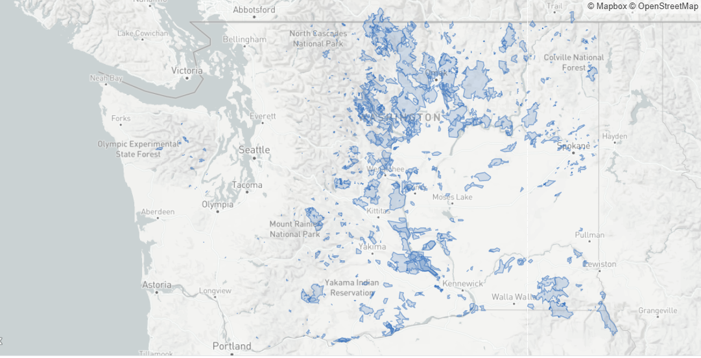

# CMPE255 Project - Wildfire Analysis and Prediction

## Team Members
1. Mohmmadsalman Mal :[salmanmal](https://github.com/salmanmal)
2. Parvathy Kannankumarath Madom Krishnan :[parvathysjsu](https://github.com/parvathysjsu)
3. Sanjana Srinivas :[Sanjana7395](https://github.com/Sanjana7395)
4. Sung-Yin Yang :[SungYinYang](https://github.com/SungYinYang)

## Dataset and Source
1. Dataset from Washington Geospatial open Data Portal.  
Source : https://geo.wa.gov/datasets/6f31b076628d4f8ca5a964cbefd2cccc_0/data?geometry=-140.484%2C41.510%2C-99.131%2C52.000    
2. Temperature dataset.     
Source : https://w2.weather.gov/climate/xmacis.php?wfo=sew

## Preliminary Analysis
### Washington Geospatial open Data Portal 
The process of cleaning the data involved - 
1. Removing unnecessary columns, combining redundant values (eg - 'human' and 'adult') and
correcting spelling errors
2. Finding the county and city details from the geospatial shape file.
3. And finally mapping wildfire data with its corresponding location from the shape file.
 
Analysing the above dataset we observe that -    
1. There is an increasing trend in the occurrence of wildfires over the years from 1973 to 2019 as shown in the graph below. The maximum number was recorded in 2015 with over 70 wildfires.

2. From figure below we observe that major known cause of wildfires in the Washington state is mostly **Lightening** This has accounted for almost 200 fires in the region. The other major causes of fire are human induced and arson. 

3. The graph shows all the wildfires that occured between 1973 and 2019 per its cause. From the graph its evident that for a majority of wildfires, the cause is unknown. For those whose cause is known, lightning is the major cause of wildfires expecially after the year 2000. The next major cause is human and these fires mainly occured after 2013.

4. The figure shows the wildfires per county. Chelan county tops the list with over 100 fires. Its followed by Okanogan county, Spokane county, and Klickitat county all having over 50 fires.

5. The figure shows a map of Washington state with all the areas that had wildfires. This map is constructed using the shape file that had coordinates for the locations.

6. The figures show the univariate plots of Acres attribute which is the number of acres burnt by the wildfires.
<table>
  <tr>
    <td></td>
    <td></td>
  </tr>
 </table>
7. Statistics observed from the dataset after preprocessing 
<li> * Dataframe shape:  (683, 8) </li>
<li> * Acres: Minimumvakue is 0.3 and the maximum value is 255899. </li>
<li> * Cause: For 394 wildfires, cause is unknown. For 194 wildfires, the cause is lightning, which is also the known cause for the highext number of wildfires. The next highest cause known is human followed by arson. </li>
<li> * County: Chelan county has the maximum number of wildfires. It is followed by Okanogan county, Spokane county, and Klickitat county </li>
<li> * Year: The number of wildfires has increased over the years. Year 2015 had the maximum wildfires. </li>

### Temperature dataset 

### Merged dataset  

### Models
1. Convolution Neural Network      
The CNN model will learn a function to map the sequence of input observations that we obtained from merging wildfire
and temperature datasets to predict the occurrence of wildfire in a given region. The CNN models are known for 
generating a good estimated predictive accuracy. Below figure shows a simple CNN model.

2. Logistic regression  
This model helps in predicting the probability of the event's success or failure. The major limitation of
this method is the assumption of linearity between input and output variables. 

<table>
  <tr>
    <td>CNN model</td>
    <td>Logistic regression</td>
  </tr>
  <tr>
    <td></td>
    <td></td>
  </tr>
 </table>
