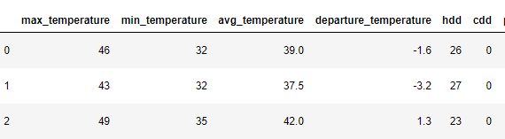
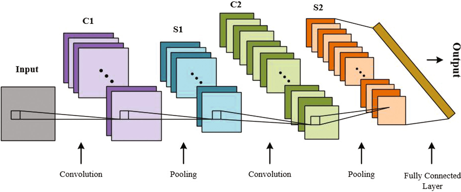

# CMPE255 Project - Wildfire Analysis and Prediction

## Team Members
1. Mohmmadsalman Mal :[salmanmal](https://github.com/salmanmal)
2. Parvathy Kannankumarath Madom Krishnan :[parvathysjsu](https://github.com/parvathysjsu)
3. Sanjana Srinivas :[Sanjana7395](https://github.com/Sanjana7395)
4. Sung-Yin Yang :[SungYinYang](https://github.com/SungYinYang)

## Dataset and Source
1. Wildfires Dataset from Washington Geospatial Open Data Portal.  
Source : https://geo.wa.gov/datasets/6f31b076628d4f8ca5a964cbefd2cccc_0/data?geometry=-140.484%2C41.510%2C-99.131%2C52.000    
2. Temperature Dataset.     
Source : https://w2.weather.gov/climate/xmacis.php?wfo=sew

## Preliminary Analysis
### Dataset Analysis
#### Wildfire Dataset from Washington Geospatial Open Data Portal 
The wildfire dataset from Washington Geospatial Open Data Portal contains information related to wildfires in Washington state from 1973-2019. 
The process of cleaning the data involved - 
1. Removing unnecessary columns, combining redundant values (eg - 'human' and 'adult') and
correcting spelling errors
2. Finding the county and city details from the geospatial shape file.
3. And finally mapping wildfire data with its corresponding location from the shape file.
 
Analysing the above dataset we observed that -    
1. There is an increasing trend in the occurrence of wildfires over the years from 1973 to 2019 as shown in the graph below. The maximum number was recorded in 2015 with over 70 wildfires.

2. From the figure below we observe that major known cause of wildfires in the Washington state is mostly Lightening. This has accounted for almost 200 fires in the region. The other major causes of fire are human induced and arson. 

3. The graph shows all the wildfires that occurred between 1973 and 2019 per its cause. From the graph it is evident that for a majority of wildfires, the cause is unknown. For those whose cause is known, lightning is the major cause of wildfires especially after the year 2000. The next major cause is human and, these fires mainly occurred after 2013.

4. The figure shows the wildfires per county. Chelan county tops the list with over 100 fires. Its followed by Okanogan county, Spokane county, and Klickitat county all having over 50 fires.

5. The figure shows a map of Washington state with all the areas that had wildfires. This map is constructed using the shape file that had coordinates for the locations.

6. The figures show the univariate plots of Acres attribute which is the number of acres burnt by the wildfires.
<table>
  <tr>
    <td></td>
    <td></td>
  </tr>
 </table>
7. Statistics observed from the dataset after preprocessing 
<li>Dataframe shape:  (683, 8) </li>
<li>Acres: Minimum value is 0.3 and the maximum value is 255899. </li>
<li>Cause: For 394 wildfires, cause is unknown. For 194 wildfires, the cause is lightning, which is also the known cause for the highext number of wildfires. The next highest cause known is human followed by arson. </li>
<li>County: Chelan county has the maximum number of wildfires. It is followed by Okanogan county, Spokane county, and Klickitat county </li>
<li>Year: The number of wildfires has increased over the years. Year 2015 had the maximum wildfires. </li>

#### Temperature dataset 
To analyse the correlation between these wildfires and weather, we extracted past 20 years weather data from https://w2.weather.gov for all the weather stations in Washington state using our [wather_scrapper.py](data/weather_scrapper.py) script. 

The process of extracting and cleaning the data involved -

* Understanding the REST API request body and finding washington state's weather station ids.
* Removed records which had missing values of temperature, precipitation and other attributes.
* Append station ids and station name to later identify county and city, which will eventually help in merging the wildfire and weather data.
* Saved as [weather_data.csv](data/weather_data.csv) to later analyse and merge with wildfire dataset.

Analysing the temperature dataset we observed that -
*  The following mean temperature over the years graph shows the history of average temperature over the last 20 years period. From the data it is evident that there is a rise in average temperature over this period with some fluctuation. Between the period 2011 to 2015 temperature had a steep rise from 55 °F to 62 °F.
On comparing both of the following graphs, we can clearly see the positive relation between temperature and number of wildfires in that year. Year 2015 had the record breaking average temperature of 62 °F and maximum number of wildfires.
 
 
 
 
*  The following graph shows the max temperature over the years. The max temperature over the period has risen from 96 °F to 105 °F. The spike at year 2007 lies way beyond the normal distance from the others and could easily be identified as outlier. To reduce such misleading sample, instead of taking max from the year, in training the model we decided to take average of first 10 max values for that year.
 
 
 
 
#### Merged dataset  
In our wildfire dataset, there is no weather information such as temperature, humidity, and precipitation. Thus, we need to merge the weather dataset and the wildfire dataset.

The two datasets would be merged based on the location of the time and the range of the wildfire date. Additional cleaning in the weather dataset and forest dataset is required. The goal is to add new attributes such as max_temperature, min_temperature, average_temperature, average_precipitation, average_humid_degree, average_cooling_degreeday into the wildfire dataset.

Additional cleaning in Weather Dataset involved:
* Remove rows with 'M' values in max_temperature, min_temperature, avg_temperature	departure_temperature, hdd, cdd, and percipitation columns.
* Remove non-numeric value in the numeric attribute field.
* Add latitude coordinates and longitude coordinates for each station.
* Update the date attribute to the format of Python Time Object for better comparison.

The following pictures show examples of weather dataset.

Additional cleaning in Wildfire Dataset involved:
* Add Attribute "Centroid," which is calculated based on the geometry polygon given by the geojson file.
* Add Attribute "nearest Station." Euclidean distance is used to calculate the nearest weather station where the wildfire happens. This attribute contains the longitude and latitude coordinate of the station.
* Update the date attribute to the format of Python Time Object for better comparison.

The following picture shows the added attribute.

Steps of merging the two dataset
* First, additional cleaning would be performed on the two datasets.
* Second, each wildfire record would map to rows of weather data based on the nearest station. The rows of weather data would be the range of the date that the wildfire is happening.
* Finally, the average value of the weather data would be calculated and add to the wildfire dataset.

The following pictures show the merge dataset.

### Models
1. Convolution Neural Network      
The CNN model will learn a function to map the sequence of input observations that we obtained from merging wildfire
and temperature datasets to predict the occurrence of wildfire in a given region. The CNN models are known for 
generating a good estimated predictive accuracy. Below figure shows a simple CNN model.

2. Logistic regression  
This model helps in predicting the probability of the event's success or failure. The major limitation of
this method is the assumption of linearity between input and output variables. 

<table>
  <tr>
    <td>CNN model</td>
    <td>Logistic regression</td>
  </tr>
  <tr>
    <td></td>
    <td></td>
  </tr>
 </table>
