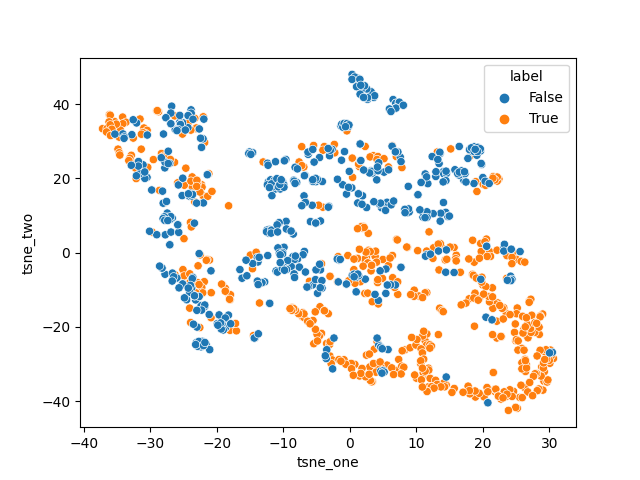

# CMPE255 Project - Wildfire Analysis and Prediction

## Team Members
1. Mohmmadsalman Mal :[salmanmal](https://github.com/salmanmal)
2. Parvathy Kannankumarath Madom Krishnan :[parvathysjsu](https://github.com/parvathysjsu)
3. Sanjana Srinivas :[Sanjana7395](https://github.com/Sanjana7395)
4. Sung-Yin Yang :[SungYinYang](https://github.com/SungYinYang)

## Dataset and Source
1. Wildfires Dataset from Washington Geospatial Open Data Portal.  
Source : https://geo.wa.gov/datasets/6f31b076628d4f8ca5a964cbefd2cccc_0/data?geometry=-140.484%2C41.510%2C-99.131%2C52.000    
2. Temperature Dataset.     
Source : https://w2.weather.gov/climate/xmacis.php?wfo=sew

## Abstract
Wildfire is the most common form of a natural disaster. It is an unplanned and unwanted fire in areas with
combustible vegetation. Wildfires wreaked havoc in many states of the USA in the year 2020.
In this year alone, more than 8 million acres had been burnt. Wildfires affect forest cover, wildlife,
human habitat, and adversely influence climatic changes. A NICC report states that
on average, around 2500 homes are destroyed or impacted every year due to wildfires. Therefore, it
is essential to adopt measures to tackle this situation. Early detection or prediction
can promote early response, thereby minimizing the adversities caused by the fire. Through this project, we propose
a model to identify the occurrence of wildfire given the temperature and precipitation details of the region. Four
different models are used namely - Logistic regression, KNN, SVM and Decision tree. From the experiments we have
identified that the Decision tree model performed the best with an accuracy of 00.00% and F1-score of 00.00%.  

## Experiments/Analysis
The experimentation involved preprocessing analysing the wildfire and temperature datasets, merging the two datasets and 
classifying the occurrence.

### Preprocessing wildfire dataset
The wildfire dataset consisted of a spreedsheet, which included the start and end date of the fire, cause, firename
etc and a geospatial shapefile which included the geographical points of the shape of the corresponding wildfire. To
use these data to analyze and predict the occurrence of wildfire the following preprocessing steps were performed - 
1. Removing unnecessary columns and redundant values (eg - 'human' and 'adult' in cause field), and rectifying spelling
errors in the spreadsheet.
2. Extracting the centre coordinate values from the geographical shapes in the shapefile. The centre coordinates are
used to identifying the city and county details of the corresponding wildfire.
3. Finally, the spreadsheet contents are mapped with its corresponding city and county values from the shapefile using
the common feature firename.

### Analysis/visualization of wildfire dataset

### Scraping, preprocessing and analysis of temperature dataset
#### Salman Mal

### Merging the wildfire and temperature dataset
#### Steven

### Adding negative data
#### Data Ratios(Steven)

### Analysis of merged data
#### Salman Mal (Correlation Matrix)
The objective of the classification model is to predict the occurrence of wildfire given the weather details of
the region. The input features include - temperatures (min, max, hdd and cdd) and precipitation. The relation between
the input features - max_temperature and precipitation - with the output data is shown below - 
<table>
  <tr>
    <td>Max temperature with output</td>
    <td>Precipitation with output</td>
  </tr>
  <tr>
    <td></td>
    <td></td>
  </tr>
 </table>
 
 From the figure we see that the temperature has positive relation with the occurrence of wildfire i.e. as the
 temperature increases the probability of the wildfire occurrence is high. And precipitation has a negative
 relation - the lower the precipitation value in the region, the higher the probability of wildfire occurrence.

### Classification models
We have four classification models to identify the occurrence of wildfire given the weather details - temperatures(max,
avg, min, hdd, cdd) and precipitation - of the region. The following are the models used - 

1. Logistic regression  
Identifying the occurrence of wildfire is a binary classification problem which can be trained using a 
simple logistic regression model. The below experiments were performed to improve the performance of the model
1. Initially, the input data was trained using sklearn LogisticRegression().
2. The input data was normalized to scale before being fed into the model. This helped in removing anomalies and 
grouping the similar data together.
3. GridSearchCV - The hyperparameters of the model namely - C, scaler and penalty were experimented with different
variation to find the optimal values. The best results were obtained using C=10, scaler='liblinear' and penalty='l2'.   
The results of the above experiments are recorded in the table below  
<table>
  <tr>
    <td>Experiments</td>
    <td>Accuracy (%)</td>
  </tr>
  <tr>
    <td>Initial model</td>
    <td>70.00</td>
  </tr>
  <tr>
    <td>Normalizing input data</td>
    <td>75.12</td>
  </tr>
  <tr>
    <td>Hyperparameter search</td>
    <td>77.62</td>
  </tr>
 </table>
The t-SNE plot of the dataset is shown below.

From the t-SNE plot, we observe that the data is not easily separable. Therefore, we need a more sophisticated
model to classify the occurrence of wildfire.

2. KNN

3. SVM

4. Decision Trees

Dataset Data Ratio | Accuracy | Confusion Matrix
------------ | ------------- | -------------
1:1 | 88.1% | 
1:2 | 92.04% | 
1:4 | 94.07% | 
1:8 | 95.22% | 
1:16 | 97.75% | 
1:32 | 98.75% | 
1:300 | 99.89% | 

## Comparisons
Below are the consolidated performance of different models.
<table>
  <tr>
    <td>Classification models</td>
    <td>Accuracy (%)</td>
    <td>F1-score</td>
  </tr>
  <tr>
    <td>Linear regression</td>
    <td>77.62</td>
    <td>0.75</td>
  </tr>
  <tr>
    <td>KNN</td>
    <td>75.12</td>
    <td>77.62</td>
  </tr>
  <tr>
    <td>SVM</td>
    <td>77.62</td>
    <td>77.62</td>
  </tr>
  <tr>
    <td>Decision tree</td>
    <td>77.62</td>
    <td>77.62</td>
  </tr>
 </table>

## Conclusion
From the above experiments, Decision Tree best identifies the occurrence of
wildfire with accuracy of …….. And F1 score of ………

## Future Recommendations
There is scope for improving the performance of classification model with the help of - 
1. Availability of more wildfire data - This can promote the use of complex deep learning model to achieve exemplary
performance
2. Addition of input weather features, so to achieve a more separable cluster. 

