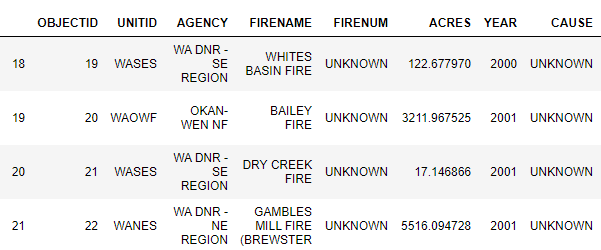
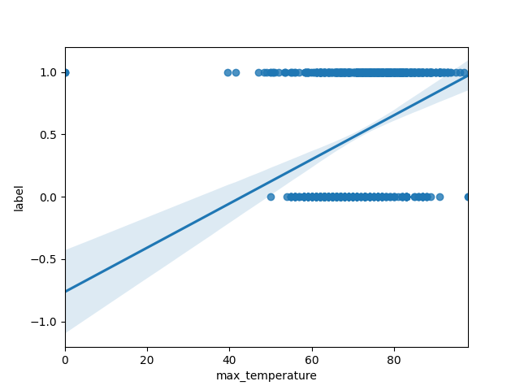
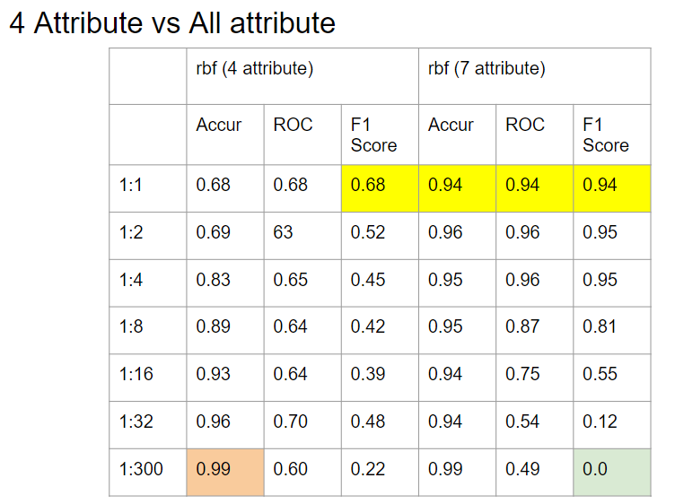
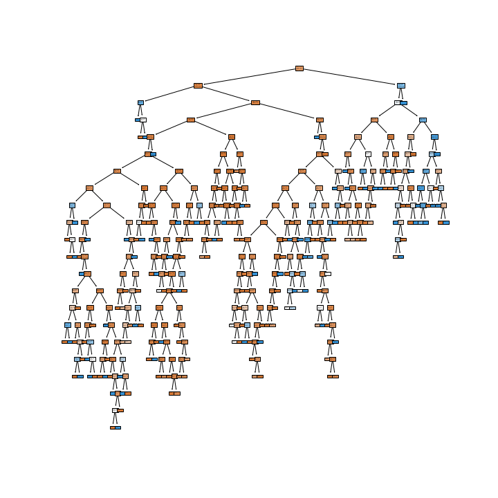

# CMPE255 Project - Wildfire Analysis and Prediction

## Team Members
1. Mohmmadsalman Mal :[salmanmal](https://github.com/salmanmal)
2. Parvathy Kannankumarath Madom Krishnan :[parvathysjsu](https://github.com/parvathysjsu)
3. Sanjana Srinivas :[Sanjana7395](https://github.com/Sanjana7395)
4. Sung-Yin Yang :[SungYinYang](https://github.com/SungYinYang)

## Dataset and Source
1. Wildfires Dataset from Washington Geospatial Open Data Portal.  
Source : https://geo.wa.gov/datasets/6f31b076628d4f8ca5a964cbefd2cccc_0/data?geometry=-140.484%2C41.510%2C-99.131%2C52.000    
2. Temperature Dataset.     
Source : https://w2.weather.gov/climate/xmacis.php?wfo=sew

## Abstract
Wildfire is the most common form of a natural disaster. It is an unplanned and unwanted fire in areas with
combustible vegetation. Wildfires wreaked havoc in many states of the USA in the year 2020.
In this year alone, more than 8 million acres had been burnt. Wildfires affect forest cover, wildlife,
human habitat, and adversely influence climatic changes. A NICC report states that
on average, around 2500 homes are destroyed or impacted every year due to wildfires. Therefore, it
is essential to adopt measures to tackle this situation. Early detection or prediction
can promote early response, thereby minimizing the adversities caused by the fire. Through this project, we propose
a model to identify the occurrence of wildfire given the temperature and precipitation details of the region. Four
different models are used namely - Logistic regression, KNN, SVM and Decision tree. From the experiments we have
identified that the Decision tree model performed the best with an accuracy of 94.07% and F1 score of 0.86 

## Experiments/Analysis
The experimentation involved preprocessing analysing the wildfire and temperature datasets, merging the two datasets and 
classifying the occurrence.

### Preprocessing wildfire dataset
The wildfire dataset consisted of a spreedsheet, which included the start and end date of the fire, cause, firename
etc and a geospatial shapefile which included the geographical points of the shape of the corresponding wildfire. To
use these data to analyze and predict the occurrence of wildfire the following preprocessing steps were performed - 
1. Removing unnecessary columns and redundant values (eg - 'human' and 'adult' in cause field), and rectifying spelling
errors in the spreadsheet.
2. Extracting the centre coordinate values from the geographical shapes in the shapefile. The centre coordinates are
used to identifying the city and county details of the corresponding wildfire.
3. Finally, the spreadsheet contents are mapped with its corresponding city and county values from the shapefile using
the common feature firename.

### Analysis and visualization of wildfire dataset
Analysing the wildfire dataset we observed that -    
1. There is an increasing trend in the occurrence of wildfires over the years from 1973 to 2019 as shown in the graph below. The maximum number was recorded in 2015 with over 70 wildfires.

<table>
  <tr>
    <td>Wildfires over the years</td>
    <td>Causes of wildfires</td>
  </tr>
  <tr>
    <td></td>
    <td></td>
  </tr>
 </table>
2. From the figure below we observe that major known cause of wildfires in the Washington state is mostly Lightening. This has accounted for almost 200 fires in the region. The other major causes of fire are human induced and arson. 
3. Chelan county tops the list of wildfires per county with over 100 fires. Its followed by Okanogan county, Spokane county, and Klickitat county all having over 50 fires.
4. The figure shows a map of Washington state with all the areas that had wildfires. This map is constructed using the shape file that had coordinates for the locations.

### Scraping, preprocessing and analysis of temperature dataset

To analyse the correlation between these wildfires and weather, we extracted past 20 years weather data from https://w2.weather.gov for all the weather stations in Washington state using our [wather_scrapper.py](data/weather_scrapper.py) script. 

The process of extracting and cleaning the data involved -

* Understanding the REST API request body and finding washington state's weather station ids.
* Removed records which had missing values of temperature, precipitation and other attributes.
* Append station ids and station name to later identify county and city, which will eventually help in merging the wildfire and weather data.
* Saved as [weather_data.csv](data/weather_data.csv) to later analyse and merge with wildfire dataset.

Analysing the temperature dataset we observed that -
*  The following mean temperature over the years graph shows the history of average temperature over the last 20 years period. From the data it is evident that there is a rise in average temperature over this period with some fluctuation. Between the period 2011 to 2015 temperature had a steep rise from 55 °F to 62 °F.
On comparing both of the following graphs, we can clearly see the positive relation between temperature and number of wildfires in that year. Year 2015 had the record breaking average temperature of 62 °F and maximum number of wildfires.
 
 
 
 
*  The following graph shows the max temperature over the years. The max temperature over the period has risen from 96 °F to 105 °F. The spike at year 2007 lies way beyond the normal distance from the others and could easily be identified as outlier. To reduce such misleading sample, instead of taking max from the year, in training the model we decided to take average of first 10 max values for that year.
 
 
 

### Merging the wildfire and temperature dataset
#### Merged dataset  
In our wildfire dataset, there is no weather information such as temperature, humidity, and precipitation. Thus, we need to merge the weather dataset and the wildfire dataset.

The two datasets would be merged based on the location of the time and the range of the wildfire date. Additional cleaning in the weather dataset and forest dataset is required. The goal is to add new attributes such as max_temperature, min_temperature, average_temperature, average_precipitation, average_humid_degree, average_cooling_degreeday into the wildfire dataset.

Additional cleaning in Weather Dataset involved:
* Remove rows with 'M' values in max_temperature, min_temperature, avg_temperature	departure_temperature, hdd, cdd, and percipitation columns.
* Remove non-numeric value in the numeric attribute field.
* Add latitude coordinates and longitude coordinates for each station.
* Update the date attribute to the format of Python Time Object for better comparison.

The following pictures show examples of weather dataset.

Additional cleaning in Wildfire Dataset involved:
* Add Attribute "Centroid," which is calculated based on the geometry polygon given by the geojson file.
* Add Attribute "nearest Station." Euclidean distance is used to calculate the nearest weather station where the wildfire happens. This attribute contains the longitude and latitude coordinate of the station.
* Update the date attribute to the format of Python Time Object for better comparison.

The following picture shows the added attribute.

Steps of merging the two dataset
* First, additional cleaning would be performed on the two datasets.
* Second, each wildfire record would map to rows of weather data based on the nearest station. The rows of weather data would be the range of the date that the wildfire is happening.
* Finally, the average value of the weather data would be calculated and add to the wildfire dataset.

The following pictures show the merge dataset.

### Adding negative data
Since we only have the dataset that has the wildfire occurs, we need to add some negative data (weather data that does not has wildfire occur) into our dataset for training.

For experiment purposes, we are not sure how many negative data need to be added. Thus, we add a different ratio of negative data into our final dataset. 
In the folder data/preprocessed, many datasets start with a number such as 1.csv, 2.csv, 4.csv, 8.csv, 16.csv, 32.csv, 64.csv.
The number means the ratio of positive data to negative data is 1 to that number. For example, 4.csv implies that the rate of positive data and the negative dataset is 1 to 4.

The negative data are added by randomly choosing other days that do not have wildfire for each positive data. For example, if a wildfire happened at latitude -121.33 and longitude 46.1, then our final data set would randomly add another day's weather information from that location. The negative ratio determines how many random weather data was added for each wildfire occurrence.

  
   

The left graph above represents one of the positive data. The right graph represents the added negative data, which is randomly chosen.

### Analysis of merged data
#### Salman Mal (Correlation Matrix)
The objective of the classification model is to predict the occurrence of wildfire given the weather details of
the region. The input features include - temperatures (min, max, hdd and cdd) and precipitation. The relation between
the input features - max_temperature and precipitation - with the output data is shown below - 
<table>
  <tr>
    <td>Max temperature with output</td>
    <td>Precipitation with output</td>
  </tr>
  <tr>
    <td></td>
    <td></td>
  </tr>
 </table>
 
 From the figure we see that the temperature has positive relation with the occurrence of wildfire i.e. as the
 temperature increases the probability of the wildfire occurrence is high. And precipitation has a negative
 relation - the lower the precipitation value in the region, the higher the probability of wildfire occurrence.

### Classification models
We have four classification models to identify the occurrence of wildfire given the weather details - temperatures(max,
avg, min, hdd, cdd) and precipitation - of the region. The following are the models used - 

#### 1. Logistic regression  
Identifying the occurrence of wildfire is a binary classification problem which can be trained using a 
simple logistic regression model. The below experiments were performed to improve the performance of the model
- Initially, the input data was trained using sklearn LogisticRegression().
- The input data was normalized to scale before being fed into the model. This helped in removing anomalies and 
grouping the similar data together.
- GridSearchCV - The hyperparameters of the model namely - C, scaler and penalty were experimented with different
variation to find the optimal values. The best results were obtained using C=10, scaler='liblinear' and penalty='l2'.
- Polynomial feature transform - Since the separation between the clusters is not linear, polynomial feature
transform was performed to improve the process of fitting an appropriate curve to classify the data. 
     
The results of the above experiments are recorded in the table below 
 
<table>
  <tr>
    <td>Experiments</td>
    <td>Accuracy (%)</td>
  </tr>
  <tr>
     <td>Initial model</td>
     <td>70.00</td>
  </tr>
  <tr>
     <td>Normalizing input data</td>
     <td>75.12</td>
  </tr>
  <tr>
     <td>Hyperparameter search</td>
     <td>77.62</td>
  </tr>
  <tr>
     <td>Polynomial feature transform</td>
     <td>84.29</td>
  </tr>
</table>
The confusion matrix of the final model is given by - 

The t-SNE plot of the dataset is shown below.

From the t-SNE plot, we observe that the data is not easily separable. Therefore, we need a more sophisticated
model to classify the occurrence of wildfire.

#### 2. KNN
Salman Mal

#### 3. SVM

After removing unnecessary columns like start, end, acres and shape area, there are still 7 attributes left. 
The remaining attributes are max_temperature, min_temperature, avg_temperature, departure temperature, hdd, cdd, precipitation.

The default SVM model is running on the kernel "rbf". Different ratios of the dataset are applied to the default model. 
The result shows a reasonable accuracy, ROC, and F1 score when the negative ratio is low. However, as more negative data added, the F1 score decrease fast.
The default SVM model even reaches an F1 score = 0 when the ratio of pos to neg is 300. 

Notice that by adding more negative data, the dataset would become more unbalanced. 
In wildfire detection, it is more important to correctly label an occurrence as wildfire, as opposed to labeling the non-wildfire one. 
Thus, it is better to pick a classifier that has a decentF1 score. In order to solve the decreasing F1 score, three attributes are eliminated.
The training result shows that using four attributes receive a better F1 score than using all the seven attributes.

Later then, using only four attributes, multiple SVM kernels such as 'rbf', 'linear', and 'sigmoid' are trained and compared with each other.

As the graph above shown, the accuracy increases as more negative data was added.
Conversely, the F1 score decreases as more negative data were added.
Overall the rbf kernel reaches the best performance in the SVM model with high accuracy and a decent F1-Score.
Notice that linear kernel also achieves a decent F1 score. It can be interpreted that the dataset that we used does not have a high dimension.

#### 4. Decision Trees

Preprocessing of data was done to remove unnecessary columns like start and end dates, acres, shapearea etc. 
The model analysis process started with data split into training and testing datasets with 8:2 ratio using sklearn.model_selection.train_test_split. The model used was sklearn.tree.DecisionTreeClassifier and it was trained using the training data. And the outcome was predicted for the test data and then compared with the expected result. This process was repeated multiple times once for each dataset of varying positive and negative data ratios. The results of those different datasets is given below.

Dataset Data Ratio | Accuracy | F1 Score
------------ | ------------- | -------------
1:1 | 88.1% | 0.89
1:2 | 92.04% | 0.88
1:4 | 94.07% | 0.86
1:8 | 95.22% | 0.78
1:16 | 97.75% | 0.79
1:32 | 98.75% | 0.81
1:300 | 99.89% | 0.79

An accuracy of over 99% was achieved with 1:300 ratio dataset, but it had lower F1 score and more false positives. The 1:1 ratio dataset had the lowest accuracy of 88%, but the fewest false positives and highest F1 score. As the count of negative data increased, accuracy increased, but number of false positives also increased and F1 score decreased. On an average, the dataset with best combination of accuracy and F1 score is selected as the 1:4 ratio dataset. The confusion matrix is shown below.

 The decision tree of the 1:4 ratio dataset is plotted below using sklearn.tree.plot_tree function.

## Comparisons
Below are the consolidated performance of different models.
<table>
  <tr>
    <td>Classification models</td>
    <td>Accuracy (%)</td>
    <td>F1-Score</td>
  </tr>
  <tr>
    <td>Linear regression</td>
    <td>84.29</td>
    <td>0.83</td>
  </tr>
  <tr>
    <td>KNN</td>
    <td>75.12</td>
    <td>77.62</td>
  </tr>
  <tr>
    <td>SVM</td>
    <td>77.62</td>
    <td>77.62</td>
  </tr>
  <tr>
    <td>Decision tree</td>
    <td>94.07</td>
    <td>0.86</td>
  </tr>
 </table>

## Conclusion
From the above experiments, Decision Tree best identifies the occurrence of
wildfire with accuracy of 94.07% and F1 score of 0.86 

## Future Recommendations
There is scope for improving the performance of classification model with the help of - 
1. Availability of more wildfire data - This can promote the use of complex deep learning model to achieve exemplary
performance
2. Addition of input weather features, so to achieve a more separable cluster. 

